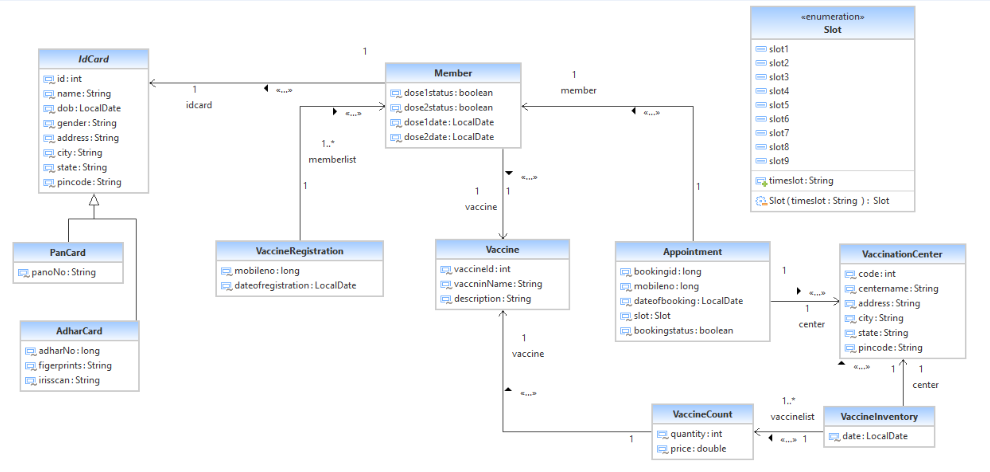

**# parallel-baseball-3621**
# Covid-19 Management System

**Probem Statement:**  
The main objective of this system is to maintain and manage detailed information of covid-19 vaccine registration & vaccinated people that happened in an area under a particular vaccination .

                                                      
**Users of this application:**   
• Citizens  
• Administrator

**Roles of Citizens** 
1) Register by Mobile Number in application
2) Add a member
3) Schedule Appointment for vaccination
4) Search for vaccination Centre

**Roles of Admin** 
1) Add new Vaccination Centre
2) Delete particular centre
3) Add vaccine for particular vaccination centre
4) Approve appointment result after vaccination of citizen.

# Relation of Database
------------------
#### **ER Diagram** 

------------------
