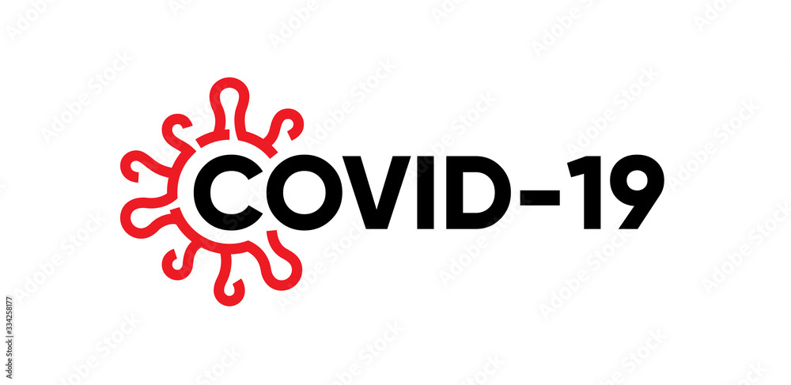

# REST API for an Covid-19 Vaccination

* A REST API has been created specifically for Covid-19 Vaccination purposes, which includes all the basic CRUD operations found in an Online Vaccine Booking platform, with user validation implemented throughout the process. 
* The project was undertaken by a team of five Back-end Developers during the Project Construct week at Masai School

# Probem Statement

* The main objective of this system is to maintain and manage detailed information of covid-19 vaccine registration & vaccinated people that happened in an area under a particular vaccination .

## Modules

* Login, Logout Module
* Admin Module
* User Module
* Book Appointment
* Vaccine Inventory Module
* Vaccination Center Module 
* Vaccine Registration Module
* Vaccine Module 

## Features

* The system includes authentication and validation for both users and administrators, utilizing session UUIDs.
* Admin Features:
    * Administrator Role of the entire application like having the access to various details pertaining to users, centers, and doses. 
    * Admin is responsible for overseeing the application as a whole
    * Only authorized administrators with valid session tokens are able to add, update, or delete drivers or users from the primary database.
    
* User Features:
    * Users are only able to access certain features once logged in.
    * This includes the ability to update their profile and view a list of available centers, as well as booking appointments
    * Users must first register with the application and then login.

## ER Diagram Of Covid-19 Application

## Tech Stack

* Java
* Spring Framework
* Spring Boot
* Spring Data JPA
* Hibernate
* MySQL
* Swagger
* Lombook

## Contributors

* Km Sakshi - Team Lead
* Shalu Gupta
* Rohan Mahangare
* Gaurav Ganguly
* Dhanushpriyan

##  Thanks for visiting our project.